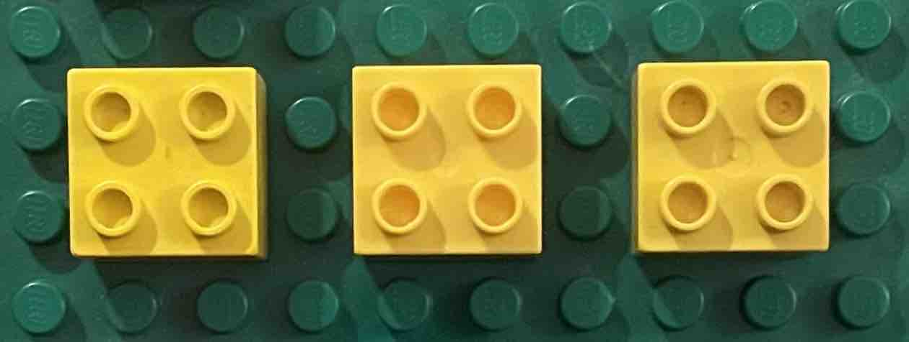
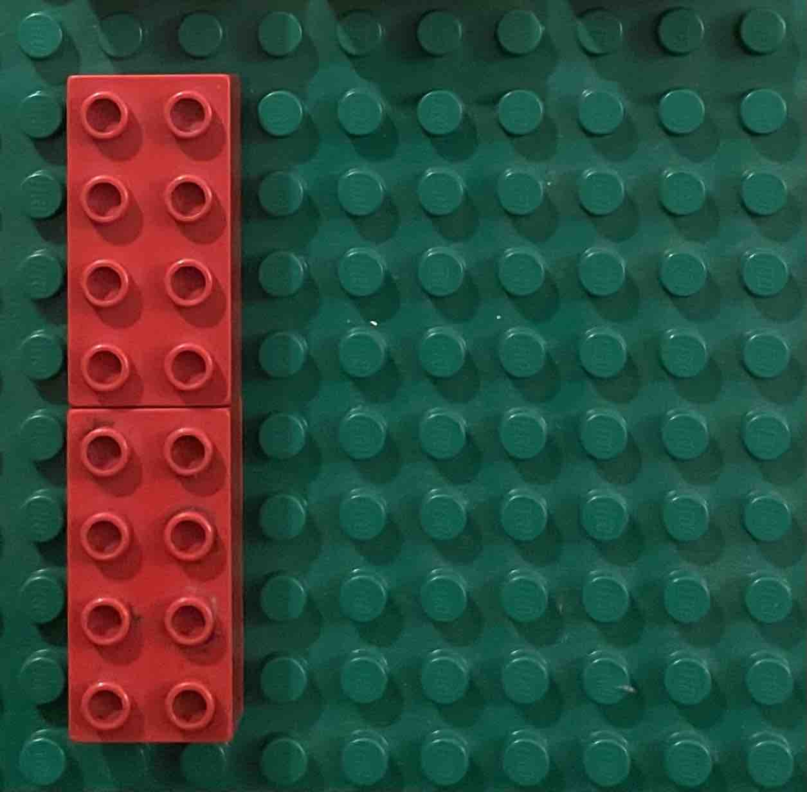
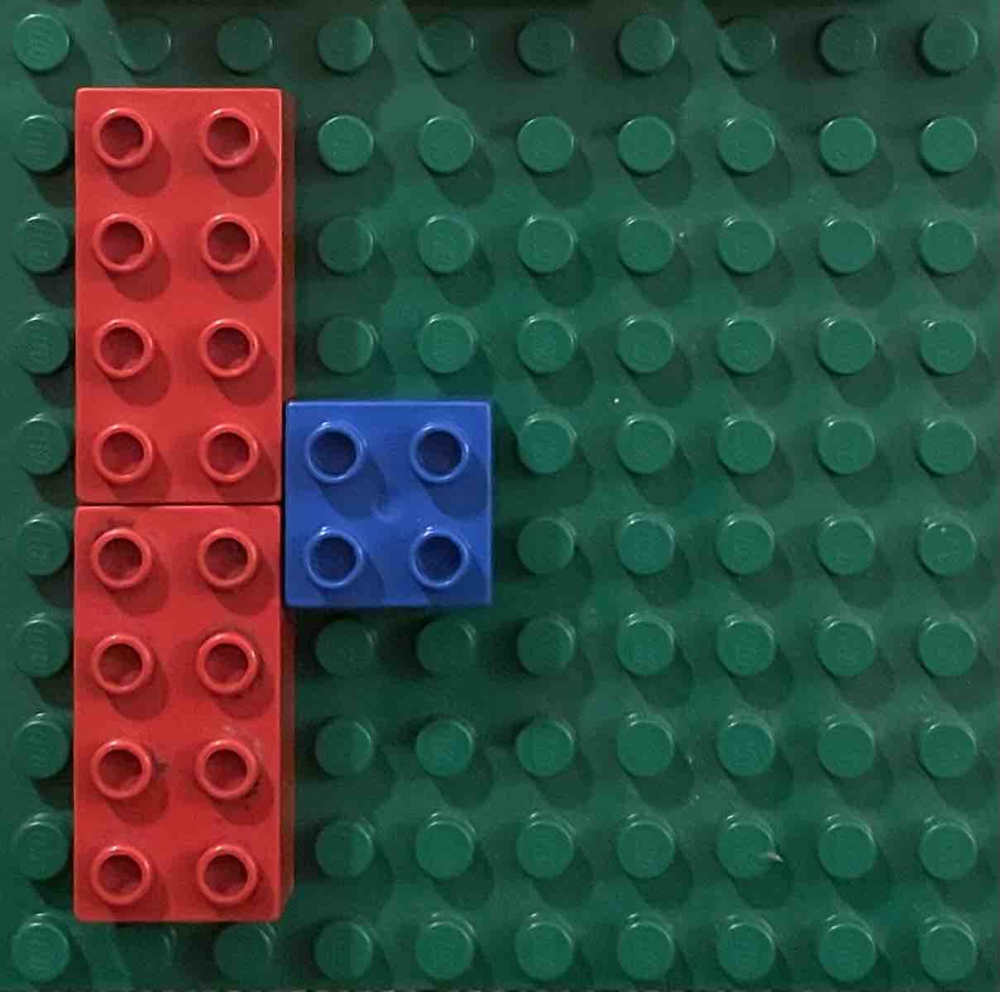
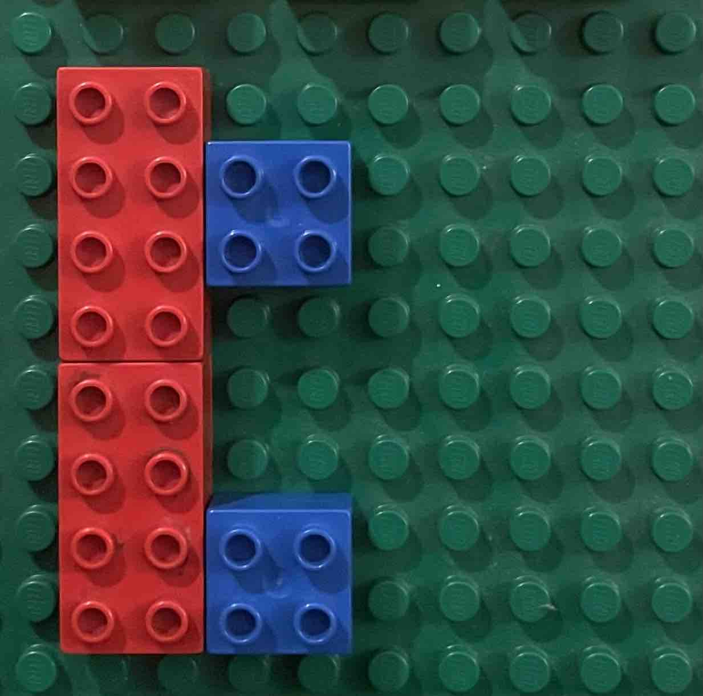
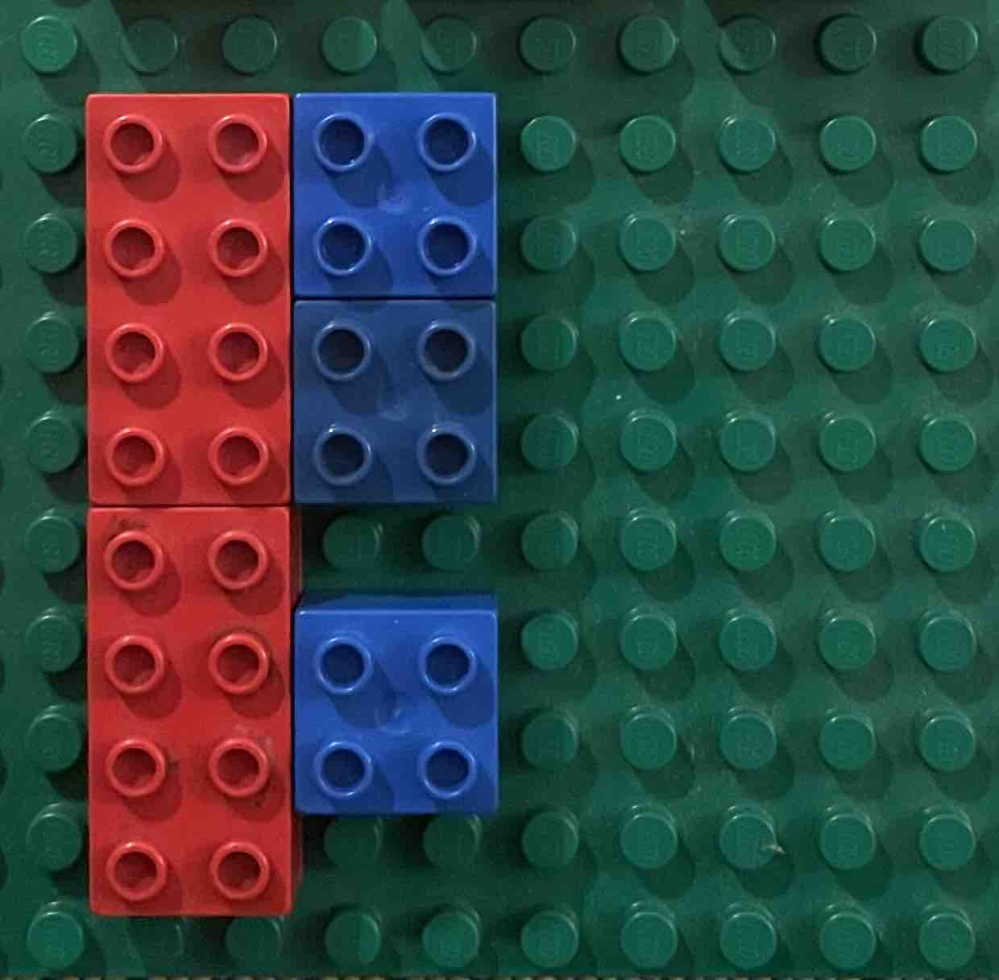
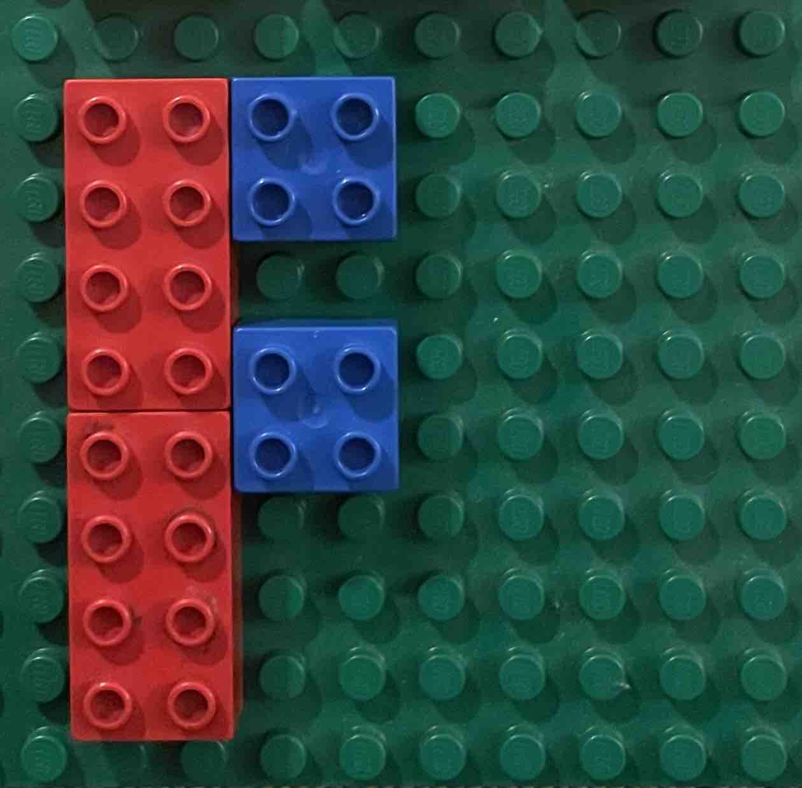
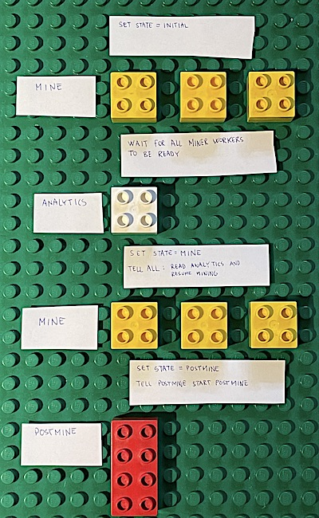
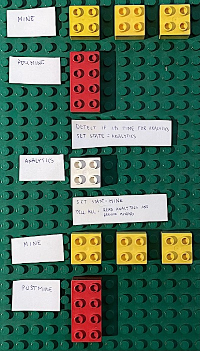

# LODA-RUST - mine

## Life cycle

Over time the state alternates between `Mine` and `Postmine`.

<table>
  <tr>
    <td>0</td>
    <td>Mine</td>
    <td></td>
    <td>Mining in parallel with 3 workers.  Accumulate until 10 candidate programs have been found.</td>
  </tr>
  <tr>
    <td>1</td>
    <td>Postmine</td>
    <td></td>
    <td>Checking the candidate programs.  Bottleneck: Only 1 worker. Ideally this should run parallel.  <b>Didn't discover any programs.</b></td>
  </tr>
  <tr>
    <td>2</td>
    <td>Mine</td>
    <td></td>
    <td>Running the mining phase again until there are sufficiently many candidate programs.</td>
  </tr>
  <tr>
    <td>3</td>
    <td>Postmine</td>
    <td></td>
    <td>Checking the candidate programs.  <b>Discovered 1 program and uploaded it to the server.</b></td>
  </tr>
  <tr>
    <td>4</td>
    <td>Mine</td>
    <td></td>
    <td></td>
  </tr>
  <tr>
    <td>5</td>
    <td>Postmine</td>
    <td></td>
    <td><b>Discovered 2 programs and uploaded them to the server.</b></td>
  </tr>
  <tr>
    <td>6</td>
    <td>Mine</td>
    <td></td>
    <td></td>
  </tr>
  <tr>
    <td>7</td>
    <td>Postmine</td>
    <td></td>
    <td><b>Discovered 3 programs and uploaded them to the server.</b>  It's incredibly rare to discover so many.</td>
  </tr>
  <tr>
    <td>8</td>
    <td>Mine</td>
    <td></td>
    <td></td>
  </tr>
  <tr>
    <td>9</td>
    <td>Postmine</td>
    <td></td>
    <td><b>Discovered 2 programs and uploaded them to the server.</b></td>
  </tr>
  <tr>
    <td>10</td>
    <td>Mine</td>
    <td></td>
    <td></td>
  </tr>
  <tr>
    <td>11</td>
    <td>Postmine</td>
    <td></td>
    <td><b>Didn't discover any programs.</b>  This is the case most of the time.</td>
  </tr>
</table>

---

## Initialization

---

## Reload analytics

